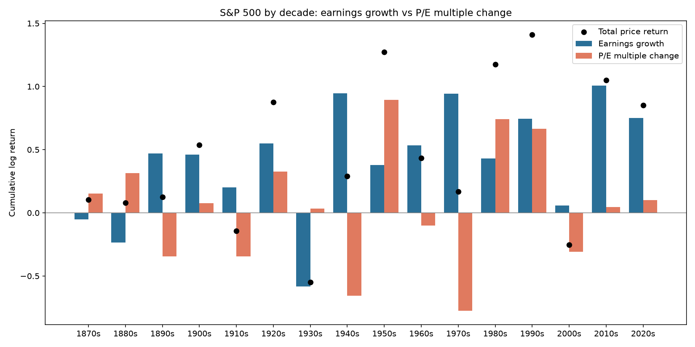
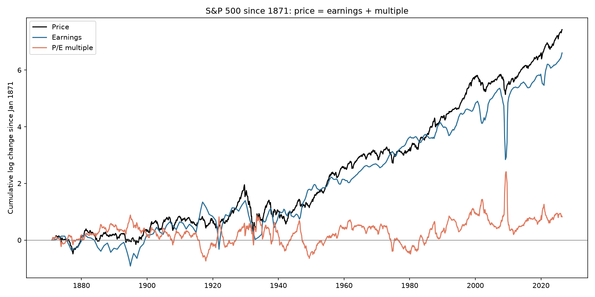
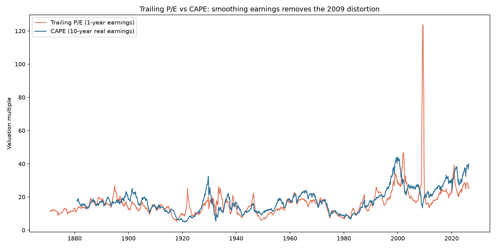

# The S&P 500 as a single stock

What drove S&P 500 returns since 1871: earnings growth or investors paying a higher multiple?
Using Robert Shiller's monthly dataset, price is decomposed as **P = E × (P/E)**, so in logs
**ln(P) = ln(E) + ln(P/E)**: every price move splits exactly into earnings growth and multiple change.

## Key findings

- **$1 in Jan 1871 became ~$1,678 (nominal price) by Jun 2026.** Earnings grew ~738x and the P/E went from 11.1 to 25.2.
- **~89% of the 155-year log gain came from earnings growth**, only ~11% from multiple expansion.
- **Decades differ sharply.** 1950s: multiple expansion did most of the work. 1970s: earnings rose strongly but the multiple collapsed, leaving price almost flat. 2010s: almost entirely earnings, multiple flat.
- **Trailing P/E can mislead.** In March 2009 trailing P/E hit 110 because earnings collapsed, while CAPE (10-year real earnings) was 13.4. Today it flips: trailing P/E 25.2 vs CAPE 39.8.
- **Regimes.** Over trailing 10-year windows, price was earnings-driven ~66% of the time and multiple-driven ~34%. The latest window is earnings-driven.

## Charts

## Method and data checks

- Source: Shiller monthly data (price, dividends, earnings, CPI).
- Cleaning: multi-row Excel header, footnote row, trailing months without reported earnings, and float-encoded dates (1871.1 = October) all handled in `src/data_loader.py`. Final table: 1,866 monthly rows, Jan 1871 to Jun 2026, no missing values.
- Earnings are trailing twelve months; Shiller interpolates quarterly earnings to months, so monthly earnings growth is smoother than reality.
- CAPE is built here from CPI-adjusted prices and a 120-month average of real earnings.
- Limitations: price returns only (no dividends), decomposition is nominal, 1870s and 2020s are partial decades.

## Run it

    pip install -r requirements.txt
    # place Shiller's ie_data.xls in data/raw/
    python main.py

## Structure

    src/data_loader.py    load and clean the data
    src/decomposition.py  returns, decomposition, CAPE, regimes
    src/viz.py            charts
    main.py               regenerates all charts in outputs/
